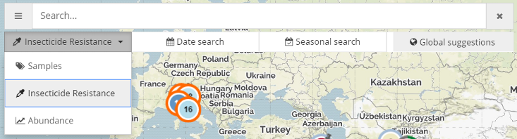

# Adding a new view to the PopBio Map

## Introduction

Popbio Map is built around the idea of flexibility and scalability. It was designed to allow for
easy addition of not only huge amounts of data but also new data types. So far the map was two
views:
1. **Samples view:** A general view to display all data with geographical coordinates that are
   currently stored in the PopBio Chado database. Exception to this rule are the special sample
   types for storing abundance samples with a sample size of 0. These sample types are currently
   excluded from this view
2. **Insecticide Resistance view:** A view to display PopBio samples with IR assays results.
   This view also includes some extra features compared to the general samples view
   - A special violin/beeswarm plot to visualise and compare IR
   - Map markers colored by their normalised IR value
   - Option to summarise the markers by Insecticide
   - Some extra, IR-related, fields in the table view

Adding a new view to the map can be straightforward but also challenging, depending on the
complexity of the extra features the view requires.

This document will try to cover the necessary steps needed to add a basic new view and then how
to customise it using the "Abundance view" (abbreviated `abnd`) as an example.


## Defining SOLR search handlers

To successfully add a new view the following SOLR search handlers need to be defined
* In the **vb_popbio** core
  1. abndPalette for palette generation
  2. abndGeoclust for clustering samples into markers
  3. abndTable for the table details panel
  4. abndExport for exporting the data into CSV format
  5. **Optional:** abndViolinStats, abndViolin, abndBeeswarm for adding violin/besswarm plots

* In the auto-complete (**vb_ta**) core
  1. abndAc
  2. abndAcgrouped
  3. abndAcat

More details about setting up and configuring the two SOLR cores are provided [here](SOLR.md)

## White-listing SOLR handlers in the SOLR security proxy

Once the appropriate search handlers have been configured and added, they must be made
accessible through the internet. Since SOLR is unsecured by default, access is controlled
through a nodeJS service, the
[SOLR security proxy](https://github.com/dergachev/solr-security-proxy). There are a few ways to
white-list search handlers in SOLR security proxy, but the one we use by setting the
`--validPaths` parameter at launch time:

``` shell
# crontab entry for SOLR security proxy. Port numbers and directory names have been masked

@reboot export NODE_ENV=production; forever start -a -l forever.log -o out.log -e err.log \
--workinDir /home/xxxx/node_modules/solr-security-proxy/ \
/home/xxxx/node_modules/solr-security-proxy/solr-security-proxy.js \
--port xxxx --backendPort xxxx \
--validPaths "/solr/vb_ta/smplAc,/solr/vb_ta/smplAcat,/solr/vb_ta/smplAcgrouped,/solr/vb_ta/irAc,\
/solr/vb_ta/irAcat,/solr/vb_ta/irAcgrouped,/solr/vb_ta/abndAc,/solr/vb_ta/abndAcat,\
/solr/vb_ta/abndAcgrouped,/solr/vb_popbio/smplGeoclust,/solr/vb_popbio/smplMarkers,\
/solr/vb_popbio/smplTable,/solr/vb_popbio/smplPalette,/solr/vb_popbio/smplCloud,\
/solr/vb_popbio/irGeoclust,/solr/vb_popbio/irMarkers,/solr/vb_popbio/irTable,\
/solr/vb_popbio/irPalette,/solr/vb_popbio/irCloud,/solr/vb_popbio/irBeeswarm,/solr/vb_popbio/irViolin,\
/solr/vb_popbio/irViolinStats,/solr/vb_popbio/abndGeoclust,/solr/vb_popbio/abndMarkers,\
/solr/vb_popbio/abndTable,/solr/vb_popbio/abndPalette,/solr/vb_popbio/abndCloud,\
/solr/vb_popbio/abndBeeswarm,/solr/vb_popbio/abndViolin,/solr/vb_popbio/abndViolinStats,\
/solr/genea_expression/irGeoclust"

```

> Although straightforward, this way of white-listing is prone to errors, so hard-coding the
> valid paths in the script itself may be a better option.

## Including the new view in the DOM

A new view is accessible by the user through a drop-down menu. The id of the element is
`SelectView` and it's defined in [vb_geohashes_mean.html](../web/vb_geohashes_mean.html)



First step is to add the view in `SelectView` as in the following example. Make sure the `value`
attribute matches the abbreviation used for all view-specific SOLR search handlers (i.e.
**abdn**Geoclust).

You can also set a matching [Font Awesome](http://fontawesome.io/icons/) icon with the
`data-icon` atrribute.

``` html
<select id="SelectView" class="selectpicker" style="text-align: center;"
        data-width="100%" data-icon-Base="fa fa-fw">
    <option data-icon="fa-tags" value="smpl">Samples</option>
    <option data-icon="fa-eyedropper" value="ir">Insecticide Resistance</option>
    <option data-icon="fa-line-chart" value="abnd">Abundance</option>
</select>
```

Next step is to define the necessary [JsRender](https://www.jsviews.com/) templates inside
[vb_geohashes_mean.html](../web/vb_geohashes_mean.html). For abundance view we went ahead and
defined all of them but only `abndRowTemplate` is properly functional.

> As we add more views into the map, defining templates like that may end up tedious and hard to
> manage. Since big parts of the templates for separate views are identical, one can use the
> JsRender ability to use templates within templates.
>
> As the side panel accumulates more functionality, it is probably a good idea to switch to a
> proper web application framework such as **Angular** or **React**

## Programmatically handling the new view

Within the PobBio Map application, the current view is stored in the global variable `viewMode`.
We use this to programmatically set map properties and elements such as

1. The map legend
2. Statistics and appearance of the map markers, such as size, colours and labels.
3. The various side panels (e.g. table view or charts) and whether they are enabled for the
   currently selected view

